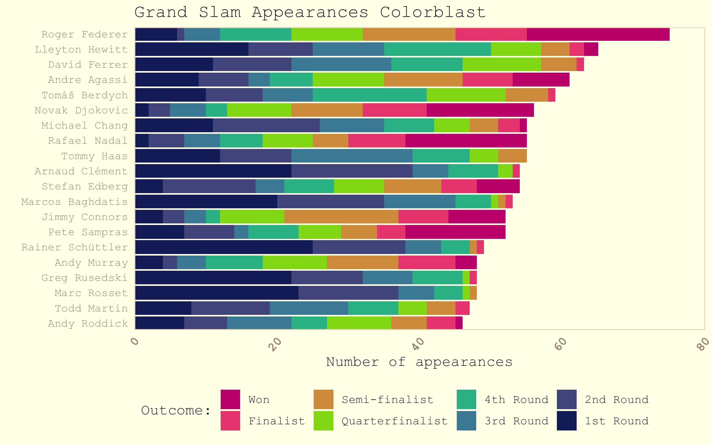

Tidy Tuesday 4/9/2019<br> Tennis Grand Slam Champions
================
Allison Horst
2019-04-10

``` r
library(tidyverse)
library(RColorBrewer)
library(wesanderson)
library(ggpomological)
library(extrafont)
library(LaCroixColoR)

# font_import()
```

Get
data:

``` r
player_dob <- readr::read_csv("https://raw.githubusercontent.com/rfordatascience/tidytuesday/master/data/2019/2019-04-09/player_dob.csv")
grand_slams <- readr::read_csv("https://raw.githubusercontent.com/rfordatascience/tidytuesday/master/data/2019/2019-04-09/grand_slams.csv")
grand_slam_timeline <- readr::read_csv("https://raw.githubusercontent.com/rfordatascience/tidytuesday/master/data/2019/2019-04-09/grand_slam_timeline.csv")
```

This seems like excessive grouping and ungrouping,
mer?

``` r
past_qual <- c("Won","Finalist","Semi-finalist","Quarterfinalist", "4th Round", "3rd Round", "2nd Round", "1st Round")

sum_table <- grand_slam_timeline %>%
  filter(!is.na(outcome), outcome %in% past_qual) %>%
  group_by(player, gender, outcome) %>%
    tally() %>%
  ungroup() %>%
  group_by(gender) %>%
  group_split() # This is pretty cool! First time using group_split()
```

Access the separate tibbles (probably bad practice, but wanted to try
using group\_splitanyway…)

``` r
male_players <- sum_table[[2]]
female_players <- sum_table[[1]]
```

Top 20 males by \# appearances after qualification (doesn’t include
absence/retire data)

``` r
top_male_appear <- male_players %>%
  group_by(player) %>%
  summarize(
    appearances = sum(n)
  ) %>%
  arrange(-appearances) %>%
  head(20)
```

Top females by \# appearances after qualification (doesn’t include
absence/retire data)

``` r
top_female_appear <- female_players %>%
  group_by(player) %>%
  summarize(
    appearances = sum(n)
  ) %>%
  arrange(-appearances) %>%
  head(20)

vec_m <- unique(top_male_appear$player)
vec_f <- unique(top_female_appear$player)
```

Joins to keep top 10 by total appearances beyond qualifying round

``` r
m_appear <- top_male_appear %>%
  inner_join(male_players) %>%
  mutate(player = as.factor(player)) %>%
  mutate(outcome = as.factor(outcome))
```

    ## Joining, by = "player"

``` r
f_appear <- top_female_appear %>%
  inner_join(female_players) %>%
  mutate(player = as.factor(player)) %>%
  mutate(outcome = as.factor(outcome))
```

    ## Joining, by = "player"

Relevel by top players

``` r
f_appear$player <- fct_relevel(f_appear$player, vec_f)
m_appear$player <- fct_relevel(m_appear$player, vec_m)
```

Relevel
outcome

``` r
f_appear$outcome <- fct_relevel(f_appear$outcome,"Won", "Finalist","Semi-finalist","Quarterfinalist","4th Round", "3rd Round","2nd Round","1st Round")

m_appear$outcome <- fct_relevel(m_appear$outcome,"Won", "Finalist","Semi-finalist","Quarterfinalist","4th Round", "3rd Round","2nd Round","1st Round")
```

Then make a graph that shows the level reached after qualifiers for
each: Create palette:

``` r
# pal <- wes_palette(8, name = "FantasticFox1", type = "continuous")
pal <- lacroix_palette("PassionFruit", n = 8, type = "continuous")
```

Graph of female top appearances:

``` r
ggplot(f_appear, aes(x = reorder(player, desc(player)), y = n)) +
  geom_col(aes(fill = outcome)) +
  theme_pomological(base_family = "Courier New", base_size = 12) +
  scale_x_discrete(expand = c(0,0)) +
  scale_y_continuous(expand = c(0,0), limits = c(0,90)) +
  scale_fill_manual(values = pal, name = "Outcome:") +
  labs(x = "", y = "Number of appearances\n(beyond qualifiers)", title = "Top Grand Slam appearances & outcomes") +
  theme(legend.position = "bottom", 
        legend.justification='left',
        axis.text.x=element_text(size=11, face = "bold", hjust = 1), axis.text.y = element_text(size = 10, color = "slateblue4")) +
  coord_flip()
```


Save it:

``` r
ggsave("my_tennis_plot.png", width = 8, height = 7)
```

Male version:

``` r
ggplot(m_appear, aes(x = reorder(player, desc(player)), y = n)) +
  geom_col(aes(fill = outcome)) +
  theme_pomological(base_family = "Courier New",
                    base_size = 12) +
  scale_x_discrete(expand = c(0,0)) +
  scale_y_continuous(expand = c(0,0),
                     limits = c(0,80)) +
  scale_fill_manual(values = pal,
                    name = "Outcome:") +
  labs(x = "", y = "Number of appearances", title = "Grand Slam Appearances Colorblast") +
  theme(legend.position="bottom",
        legend.justification = "left",
        axis.text.x=element_text(size=10, face = "bold", angle = 50, hjust = 1)) +
  coord_flip()
```


